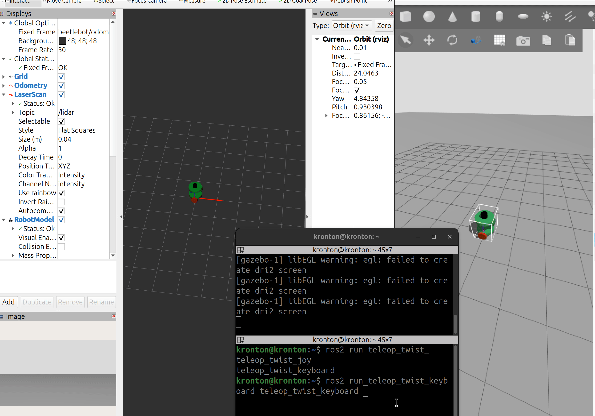
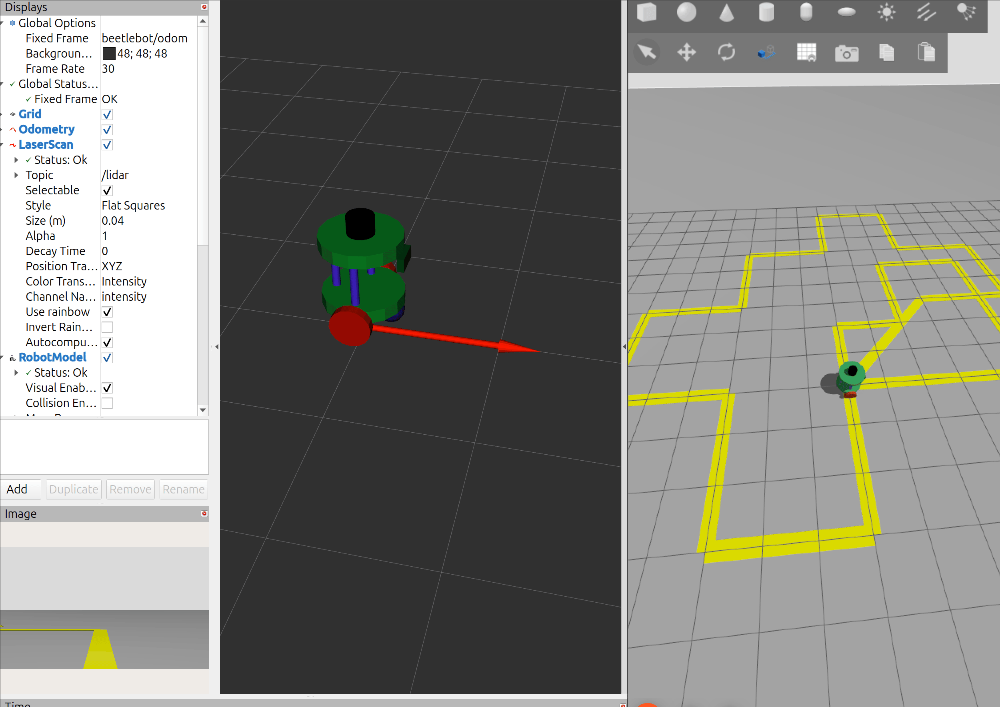
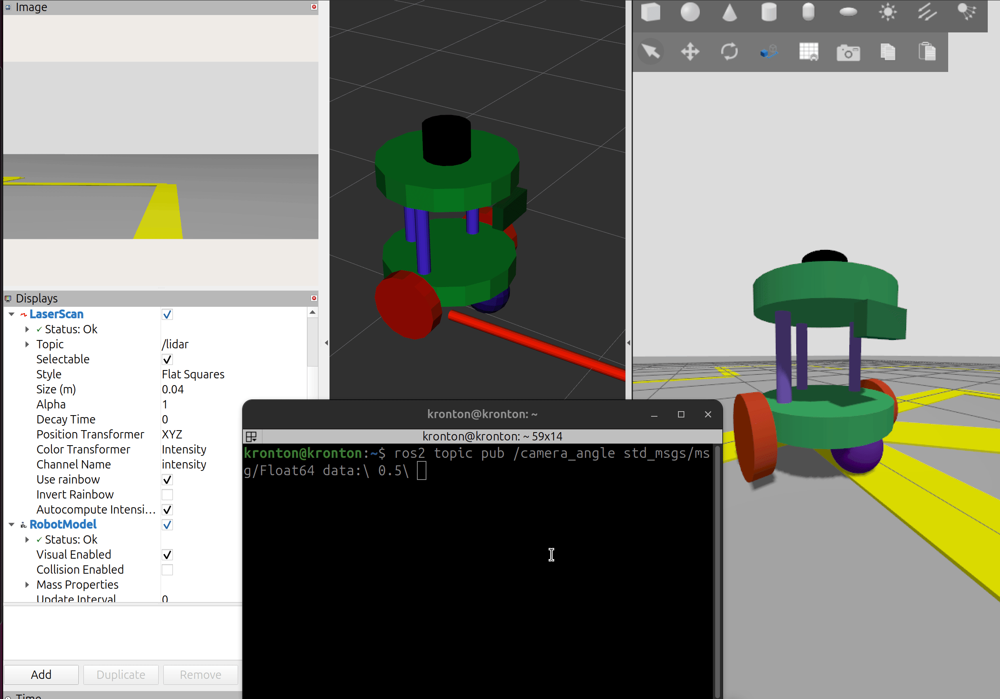

# BeetleBot - Differential Drive Robot

Welcome to the BeetleBot repository! This repository contains different configurations for the BeetleBot differential drive robot with Gazebo sim. Each branch in this repository represents a unique configuration of the same beetlebot robot in the world it operates in.


## Branches Overview

This repository has three branches, each with a different configuration for the robot and the world. 

**Below is a summary of the differences between each branch:**

### 1. [SDF-format : include robot model inside world SDF Configuration](https://github.com/KroNton/beetlebot/tree/sdf-format_include-model-world)

In this branch beetlebot robot is writen in SDF format and included inside the main world such way increase the flexibility and reusability of the robot in any new custom world.


### 2. [SDF-format : spawn robot model in the SDF world ](https://github.com/KroNton/beetlebot/tree/sdf-format_spawn-model-launch)

In this branch beetlebot robot is writen in SDF format and spawnd inside the main world using `spawner cmd` in the launch file.

### 3. [URDF-format : spawn the Xacro robot model in the SDF world](https://github.com/KroNton/beetlebot/tree/urdf-format)

In this branch beetlebot robot is writen as URDF  and spawnd inside the main world using `spawner cmd` in the launch file.


## Features

- **Separate Robot Module**: Each robot component is defined as a standalone SDF or URDF module for maximum flexibility and reusability.
- **Custom World GUI Configuration Plugins**: Includes a configurable GUI plugin to tailor the simulation interface to your needs.
- **360° LIDAR Plugin**: Provides a simulated LIDAR sensor capable of full 360° scanning for obstacle detection and mapping.
- **Differential Drive Plugin**: Implements a differential drive controller for robot mobility, ensuring smooth and accurate navigation.
- **RGB Camera**: Equipped with an RGB camera for visual feedback.
- **Position Joint Control**: Allows changing the camera angle using position joint control.

## Getting Started

### Prerequisites

Ensure you have the following:

- **ROS 2 Jazzy** installed on your system.
- **Gazebo Harmonic** for robot simulation.

### Installation

1. Clone the repository:
   ```bash
   git clone https://github.com/KroNton/beetlebot.git
   ```
2. Build the ROS 2 package:
   ```bash
   colcon build
   ```
3. Source the setup file:
   ```bash
   source install/setup.bash
   ```

### Running the Robot

#### To run the robot in the empty world:

```bashros_gz_project_template
ros2 launch beetlebot_gazebo beetlebot_empty_world.launch.py
```

### Controlling the Robot

1. **Using gazebo** 
   - add `key publisher` to gazebo form top right 
   - Use the keyboard arrow keys to move the robot.
   - Press `k` to stop the robot.
2. **Using ROS teleop node** 

   ```
   ros2 run teleop_twist_keyboard teleop_twist_keyboard
   ```
   



#### To run the robot in the warehouse world:
```bash
ros2 launch beetlebot_gazebo beetlebot_warehouse.launch.py
```


#### To run the robot in the track world:
```bash
ros2 launch beetlebot_gazebo beetlebot_track_world.launch.py
```



### Controlling the Camera Angle

You can control the camera angle by publishing to the `/camera_angle` topic.

#### Using the Terminal

1. Open a new terminal.
2. Publish a message to the `/camera_angle` topic to change the camera angle. For example, to set the camera angle to 0.5 radians:
   ```bash
   ros2 topic pub /camera_angle std_msgs/msg/Float64 "{data: 0.5}"
   ```


## Configuration Files

### `beetlebot_gazebo/config/beetlebot_ros_bridge.yaml`

This file configures the ROS-Gazebo bridge for topic communication.

```yaml
---
- ros_topic_name: "/cmd_vel"
  gz_topic_name: "/cmd_vel"
  ros_type_name: "geometry_msgs/msg/Twist"
  gz_type_name: "gz.msgs.Twist"
  direction: ROS_TO_GZ

- ros_topic_name: "/clock"
  gz_topic_name: "/world/beetlebot_world/clock"
  ros_type_name: "rosgraph_msgs/msg/Clock"
  gz_type_name: "gz.msgs.Clock"
  direction: GZ_TO_ROS
.....

```

## Future Enhancements

- Add more sensor plugins.
- Improve the robot's navigation algorithms.
- Add support for additional simulation environments.

## Resources 
- ros_gz_project_template
- 
